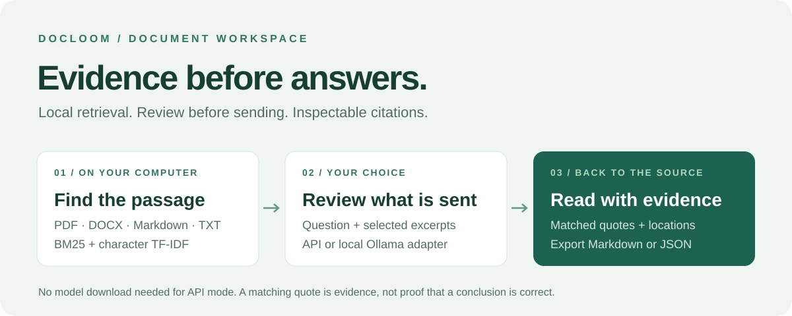
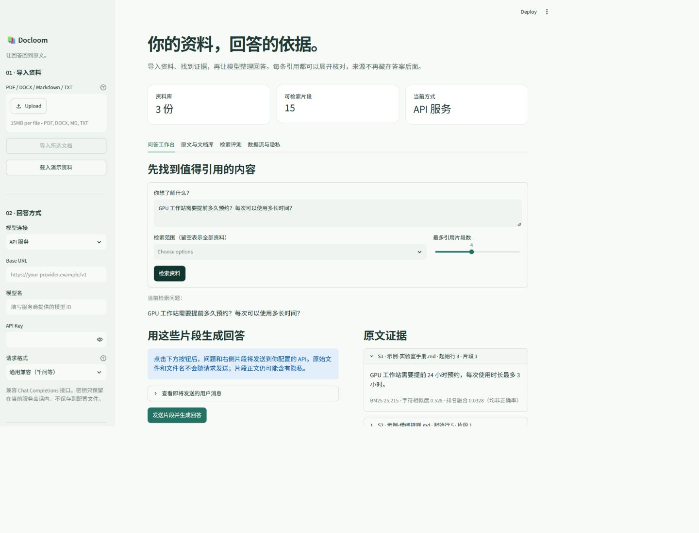

# Docloom

**先找到原文，再让 AI 回答。** 一个在个人电脑上运行的文档问答工作台：本地解析与检索，按需连接 API，也保留本地 Ollama 接口。

[English](README.en.md) · [快速开始](#快速开始) · [数据流与隐私](docs/privacy.md) · [设计与扩展](docs/architecture.md)



<details>
<summary>查看真实工作台截图（仅使用虚构资料，未连接真实 API）</summary>



</details>

## 能做什么

- 导入 PDF、Word `.docx`、Markdown 和 UTF-8 文本，按文件内容去重。
- 用 **BM25 + 字符 TF-IDF + 排名融合** 检索中英文资料，无需先下载模型。
- 在生成前查看将发送给 API 的问题和原文片段。
- 接入支持 Chat Completions 的 API，通过 Base URL、模型名和密钥配置。
- 回答附带来源引用；逐字匹配引文，遇到无效引用或 API 错误时回退到原文检索。
- PDF 定位到物理页码，DOCX 定位到正文段落或表格行，文本定位到段落起始行。
- 按文档筛选检索、检查原文、移除资料、导出 Markdown / JSON。
- 内置虚构示例和可复现的小型检索评测，无需密钥即可体验。
- 提供可替换的模型接口及 Ollama 适配器；不自动安装或下载模型。

> API 模式会将所选片段发送给你的服务商。引用匹配可以发现编造的引文，但不能保证模型推论正确。请核对重要结论。

## 快速开始

需要 Python 3.11 或更新版本。无需 Node、Docker、GPU 或本地大模型。

```bash
git clone https://github.com/tuitangziz/docloom.git
cd docloom
python -m venv .venv
```

Windows PowerShell：

```powershell
.\.venv\Scripts\python.exe -m pip install -e .
.\.venv\Scripts\python.exe -m streamlit run app.py
```

macOS / Linux：

```bash
.venv/bin/python -m pip install -e .
.venv/bin/python -m streamlit run app.py
```

在浏览器打开 **http://127.0.0.1:8501**。之后可以用 `start.ps1` 或 `sh start.sh` 启动。首次依赖安装需要联网；请从项目目录启动，使 `.streamlit/config.toml` 生效。

1. 点击「载入演示资料」或导入文档。
2. 输入问题，例如「GPU 工作站需要提前多久预约？」。
3. 点击「检索资料」，展开右侧原文核对来源。
4. 要生成回答，在左侧填写 API 配置，检查外发片段后点击「发送片段并生成回答」。

## 接入 API

| 配置 | 填写方式 |
| --- | --- |
| Base URL | 服务商提供的兼容接口根地址，通常以 `/v1` 结尾。不要加 `/chat/completions` |
| 模型名 | 控制台中可用的文本聊天模型 ID |
| API Key | 只在本机界面的密码框输入。不要发进 Issue、截图或提交到 Git |

适配器向 `Base URL + /chat/completions` 发送非流式请求，通过 Bearer 头鉴权。通用模式使用 `system` 消息和 `max_tokens=1200`；「OpenAI 新版参数」使用 `developer` 消息与 `max_completion_tokens=1200`。模型需要能按提示生成 JSON；深度思考模型可能在输出答案前耗尽这部分预算。不是所有标称“兼容”的服务都支持相同参数；当前版本不支持仅有 Responses 接口的服务、工具调用或专有鉴权方式。

千问用户请从所用地域/业务空间的控制台复制兼容接口地址，模型名和密钥需要属于对应服务配置。不要跨地域混用。参见[阿里云官方兼容接口说明](https://www.alibabacloud.com/help/en/model-studio/compatibility-of-openai-with-dashscope)。接口结构参照 [OpenAI Chat Completions 文档](https://developers.openai.com/api/reference/resources/chat/subresources/completions/methods/create)。

远程地址必须使用 HTTPS。本机测试服务允许 HTTP。客户端不跟随重定向、不自动重试、不使用环境代理，以避免向意外目标转交密钥。若网络必须经过代理，需要自行扩展传输层；不要通过不可信中转地址发送私人资料。

## 以后接本地模型

安装可信来源的 Ollama 并自行下载合适模型后，在界面选择「本地 Ollama」，填写回环地址和模型名。默认地址为 `http://127.0.0.1:11434`。本工具不会自动下载模型。

建议在启动 Ollama 前设置 `OLLAMA_NO_CLOUD=1`。适配器只接受回环地址，拒绝 `cloud` 标签及 `/api/show` 标示的远程模型，使用 [`/api/chat`](https://docs.ollama.com/api/chat)。这些检查依赖运行组件如实返回信息，不是网络隔离沙箱。

模型接口已经有模拟契约测试；没有在发布环境下载模型或声称已完成真实模型性能测试。嵌入向量接口也已预留在代码中，但当前界面默认只使用本地词法检索。

## 验证

```bash
python -m pip install -e ".[test]"
python -m pytest -q
python -m docloom.evaluation
```

测试覆盖解析和页码、DOCX 表格、无效/加密文件、检索筛选、无答案问题、会话隔离、重复导入与删除、HTTP 请求与错误处理、引用验证，以及 Streamlit 界面交互。

[检索评测结果](docs/evaluation.json)：10 个有答案问题的 Hit rate@3 和 MRR@3 均为 1.0，2 个无答案问题均未返回结果。**仅限随仓库提供的 3 份虚构资料和 12 个问题，不能解释为通用正确率。** API 契约测试使用模拟服务，不代表真实服务商已验证。

## 当前边界

- 每份文件最多 15 MiB；PDF 最多 300 页；每份提取文本最多 150 万字符；会话最多 30 份文档、5000 个片段。
- 不含 OCR，扫描 PDF 需先识别。PDF 多栏、复杂表格可能有提取顺序问题；DOCX 不提取页眉、脚注和图片文字。
- 默认检索以词面重合为主，纯同义改写可能漏召回；跨文档复杂推理和长篇总结仍有限。
- 引文存在不等于推论正确。模型可能从真实引文作出错误概括；没有声称消除幻觉或完全防御提示注入。
- 文档和索引保留在会话内存，刷新/重启可能丢失；当前无持久化知识库和多轮对话记忆。
- 面向可信个人电脑和可信文件，缺少多用户鉴权和解析沙箱，不要直接暴露到公网。

## 参与改进

欢迎提交可复现的检索失败案例、解析问题和兼容接口改进。请先替换为虚构内容，并清理密钥、文件路径和个人信息。参见 [CONTRIBUTING.md](CONTRIBUTING.md)。

MIT License。依赖与模型各自遵循其许可证，见 [THIRD_PARTY.md](THIRD_PARTY.md)。
