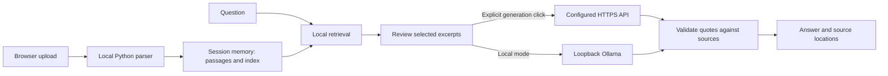

# Data flow and privacy boundaries

- API mode transmits the question and selected text passages. It does not transmit original files, filenames, all library documents or paths as separate metadata. Private data embedded in passage text is still transmitted.
- The provider receives the API key in the Authorization header. The model prompt does not contain the key. Responses and exceptions are not logged by the transport; UI errors omit raw provider bodies.
- API keys are password inputs held in Streamlit session state. They are not saved to `.env`, TOML, disk, exports or Git. Browser memory and the local Python process still contain them while used.
- The HTTP client uses HTTPS for remote targets, disables environment proxies, redirects and automatic retries. User-entered provider addresses are trusted configuration: verify them before entering credentials.
- Documents, indexes and answers are session-owned. There is no cross-session document cache. Clear removes application references, not guaranteed secure erasure from RAM, swap, browser downloads or external logs.
- Displayed document/model text is plain text, so embedded remote Markdown images are not rendered. Markdown exports escape active image/link syntax.
- Loopback binding and XSRF protection are enabled in the project config. There is no login system. Keep this as a trusted personal app and start it from the repository directory.
- Ollama's local-address and model-metadata checks do not police a modified/malicious runtime. Use a trusted runtime, disable its cloud feature and apply network isolation separately if your requirements demand it.
- Streamlit usage statistics are disabled. Package installation, GitHub visits and model/provider services have their own network behavior. There is no promise of zero external traces.
- Imported PDFs/DOCX are parsed by third-party libraries in-process with size/page limits, not in a hardened sandbox. Do not open hostile files.

## Repository hygiene

Keep `.env`, `secrets.toml`, uploads, models, local runtimes and logs out of Git. Before publishing, inspect both staged contents and commit author/committer identities. Use a GitHub noreply email. A `.gitignore` cannot remove files already committed or erase public forks.

For contribution screenshots, use only the bundled fictional demo and empty credential fields. Report security bugs privately through GitHub's private vulnerability reporting if available; do not attach secrets to public Issues.
